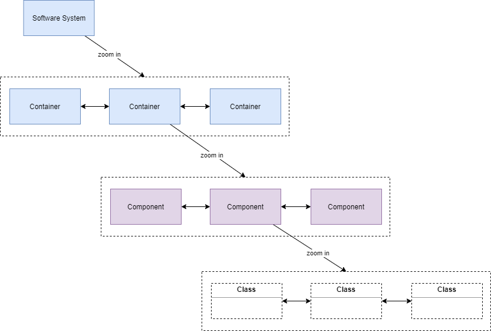
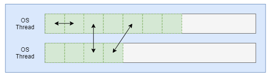
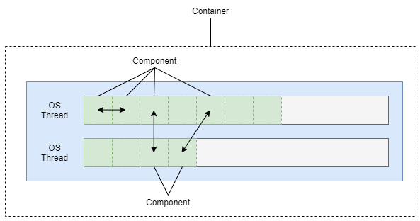
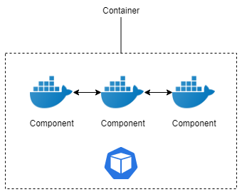

# Reseach - Take a different look at Modular Monolith

## Explore the definition of a Modular Monolith

### Signle process Monolith

- all code packaged into a singal process
- all data stored in a single database

(Kamil Grzybek - Modular Monolith: A Primer)
- a system that has exactly one deployment unit

### Cons of monolith architecture

A lot of articles have talked about the drawbacks of a Monolith Architecture. In its deep core, the challage of a Monolith Architecture is around the difficulty to deal with the complexity of time and scale". This is mostly about the ability to make changes to the application, either adding a new library, fixing a bug or deploy an update, a monolith application introduces significant overhead when your development team grows.

//TODO: delete the following:

- all in one place and not reusable

Bug in any module can potentially impact the entire application.
difficult to adopt new technologies since changes in frameworks or languages will affect an entire application

- harder to scale

This simple approach has a limitation in size and complexity.
The size of the application can slow down the start-up time.
You must redeploy the entire application on each update.
Continuous deployment is difficult.
different modules have conflicting resource requirements

- black box

Application is too large and complex to fully understand and made changes fast and correctly.
Impact of a change is usually not very well understood which leads to do extensive manual testing.

//

(https://mlsdev.com/blog/128-microservices-vs-monoliths-how-to-understand-when-it-s-time-to-use-the-former-option)
(https://articles.microservices.com/monolithic-vs-microservices-architecture-5c4848858f59)

### Modularity
(Monolith Decomposition Patterns • Sam Newman • GOTO 2019)
- Code is broken into modules
- Modules can be worked on independently
- Each module packaged together into a signle process
- Decomposited database

(Kamil Grzybek - Modular Monolith: A Primer)
- Module must be independent and interchangeable (Loose Coupling, Strong Cohesion)

num of dependencies, strength of coupling, stability of the modules on which the module depends on

- Module must have everything necessary to provide desired functionality

- Module must have defined interface

- Domain boundries

## Characteristics of Modular Monolith

If we combine the characteristics of monolith architecture and Modular programming, we will get the following checklist.

A Modular Monolith, is a system that has exactly one deployment unit, broken into modules that: 
- modules are independent and interchangeable
- modules have everything necessary to provide desired functionality
- Each module is packaged together into a signle process
- Each module has a defined interface

Worth to mention that Modular Monolith has not claimed to be a big Java application despite the fact that it is commonly intepreted that way in our industry.

## The C4 Model

Simon Brown’s C4 diagram divides a software into a number of containers(a system, NOT a deployable container), a container consists of a number of components

There are many ways to interpret this. a big componentized Java Codebase, groups of microservices. They are not quite what I’m talking about in this blog.

Where is the boundry of a monolith and a microservice?

The answer is anything. A system, a container, a component or even a class (serverless essentially makes a single function a microservice)

## A modular monolith does not have to be A big Java application

The definition and characteristics do not clearly indicate that it has to be a big Java application. But what else could it be?

## A thread-base modular monolith

6 years ago, I was working with an exGoogle Techlead Daniel on a busy calendar subscription system that synchronises over 3 million user’s calendars everyday. Daniel and his “Silicon Valley” team came up with an architecture I had never seen at the time. Today I would call it a “Modular Monolith”. Before I can clearly explain how it was designed, I need to firstly explain some fundamental concepts.

### Green Thread
“In computer programming, green threads or virtual threads are threads that are scheduled by a runtime library or virtual machine (VM) instead of natively by the underlying operating system (OS).”

Concurrency is a form of implementation leveraging the green thread concept where each "thread" is essentially an application process on an OS thread. A Scheduler is responsible for managing the execution and blocking of potentially thousands of green threads. All green threads can talk to each other or operating independently in memory.

### The modular monolith

You might start to get some idea what this has to do with what we are talking about in this blog. Imagine each component runs on an independent green thread. Each component is developed with its own interface such as a GRPC server or message queue. Communication between two components are through "network calls" in memory. We now have a loosely coupled modular monolith container running on a single instance.

This is exactly what the team built and deployed. The application ended up written in Go due to its concurreny design.

However, can we call this application a modular monolith?. Let us go back to the definition we agreed on at the start of this blog and check if this application ticks the boxes in the checklist.

- A system that has exactly one deployment unit? Yes.

- System is broken into modules? Yes.

- Module must be independent and interchangeable? Yes.

- Module have everything necessary to provide desired functionality? Yes.

- Each module is packaged together into a signle process? Yes.

- Each module has a defined interface? Yes.

## A container-based modular monolith

Back in 2016, Docker was not as popular as it is today and Kubernetes was not a thing. How could we execute this concept differently today leveraging the newest industrial practices?

"A Kubernetes pod can have many containers. Each pod can be deployed as a signle unit." This sounds surprisingly familiar. What if we build each component into an independent Docker container, then deploy a number of components in a single pod. Something like this:

Now you can create a single deployment file that deploys the 3 components as a single unit. 
Components are talking to each other locally through network calls inside a pod. can we call this application a modular monolith?

- A system that has exactly one deployment unit? Yes.

- System is broken into modules? Yes.

- Module must be independent and interchangeable? Yes.

- Module have everything necessary to provide desired functionality? Yes.

- Each module is packaged together into a signle process? Yes.

- Each module has a defined interface? Yes.

## The trade-off

Each architecture pattern has its own tradeoff. Here is a few I can think of:

- Operational and monitoring complexity
- Performance trade-off

## The pitfalls

- poor design will still criple the application

## The perks

- getting some benifit from both Monilith and Microservices architectures
- every component can be easily promoded to a container or moved to a different container

## Final words
"A good architecture enables agility" - Simon Brown.

"Abstration should reflect the code, the code structure should reflect the architecture intent".

There may have never been an intend of a battle between monolith and microservices. We all look alike and why don't we work together and make the world a better place.
